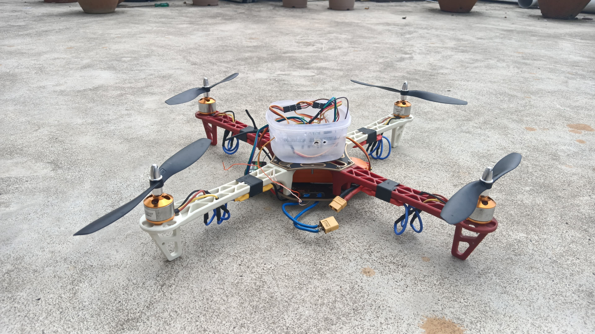
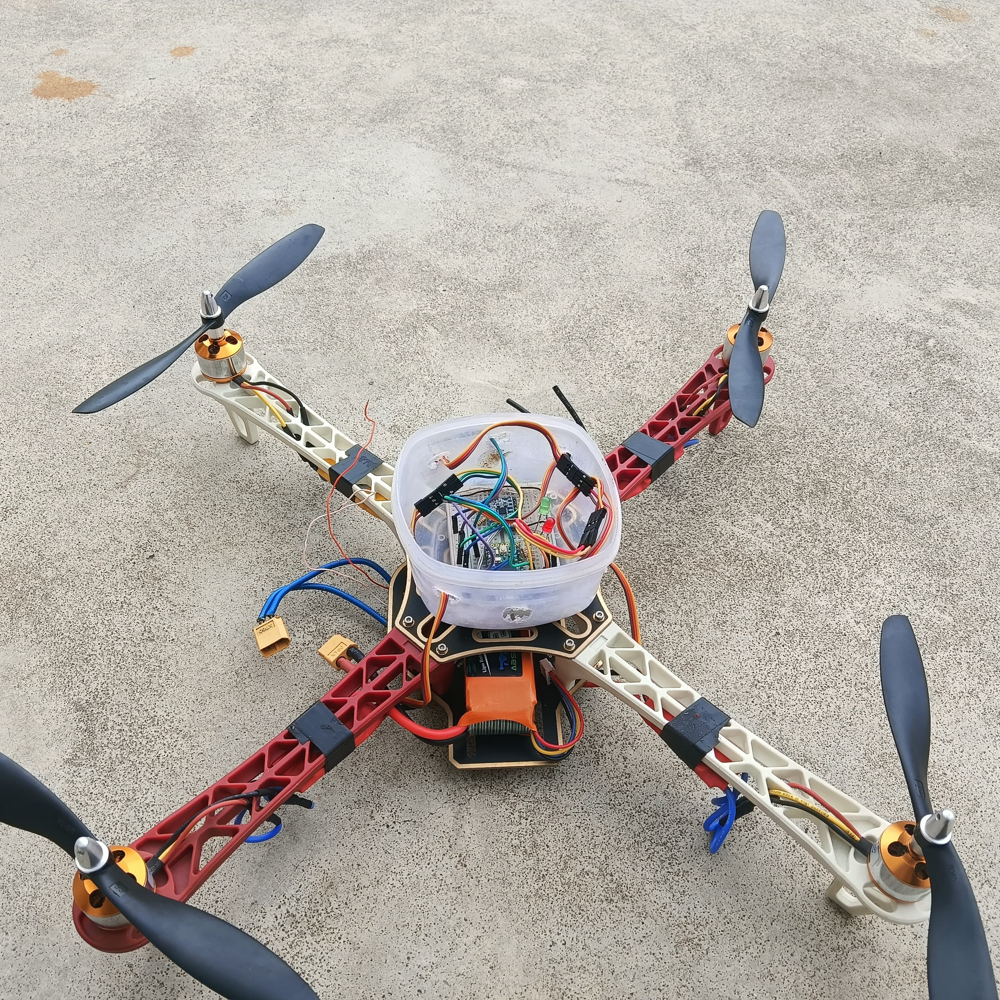

#  Experimental Quadcopter – Teensy + FS-i6 (PPM Mode)

This project is an **experimental quadcopter flight controller** built around a **Teensy microcontroller** and the **FlySky FS-i6 transmitter/receiver system** in **PPM mode**.  
The aim is to design, test, and document a custom control stack for multirotors, with a focus on **lightweight firmware**, **sensor fusion**, and **experimental control algorithms**.

---

##  Drone Build

|  |  |
|-------------------------------|-------------------------------|
| First prototype               | Top view of quadcopter       |

(You can add more images into the `images/` folder and reference them here.)

---

##  Hardware

- **MCU**: Teensy (e.g., Teensy 4.0 / 4.1, ARM Cortex-M7)  
- **Transmitter/Receiver**: FlySky FS-i6 + FS-iA6B in **PPM mode**  
- **IMU Sensor**: MPU6050 / MPU9250 (gyro + accelerometer)  
- **Motors**: Brushless DC motors with ESCs  
- **Power**: LiPo battery (3S/4S depending on design)  
- **Frame**: 250–450mm quadcopter frame  

---

##  FS-i6 Setup (PPM Mode)

1. On FS-i6 transmitter → **Settings → RX Setup → Output Mode**.  
2. Select **PPM** instead of PWM or iBus.  
3. Connect **receiver PPM output pin** → Teensy digital input (e.g., pin 23).  
4. Configure Teensy firmware to decode up to 6 channels:  
   - Throttle  
   - Roll  
   - Pitch  
   - Yaw  
   - AUX1  
   - AUX2  

---

##  Features (Planned / In Progress)

- ✅ PPM input decoding  
- ✅ IMU sensor reading (MPU6050)  
- ✅ Kalman filter for sensor fusion  
- ✅ Angle mode (basic self-leveling)  
- 🚧 Rate (acro) mode  
- 🚧 PID tuning interface  
- 🚧 Failsafe and arming logic  
- 🚧 Data logging (blackbox)  
- 🚧 Experimental autonomous features  

---
